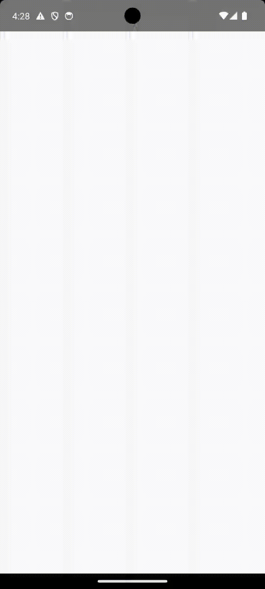
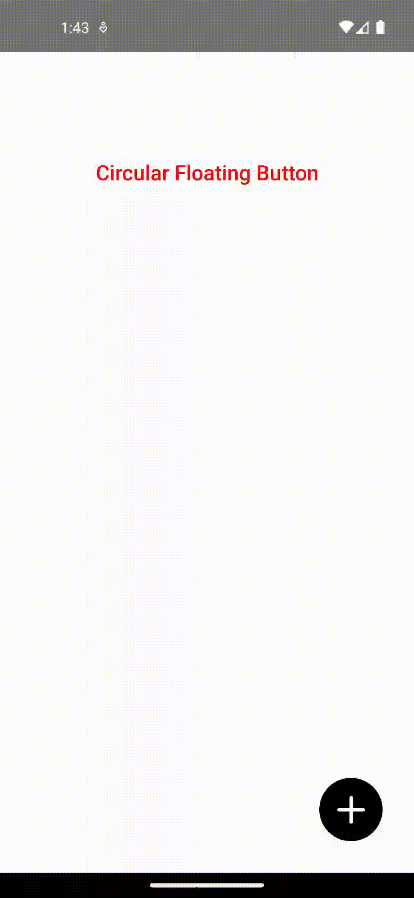
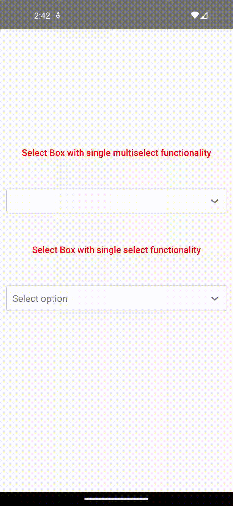
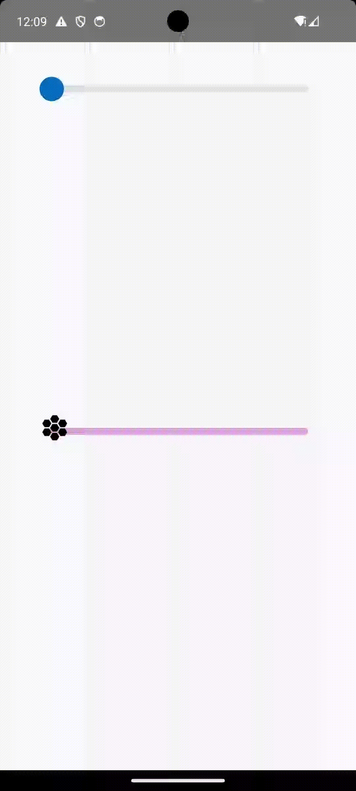
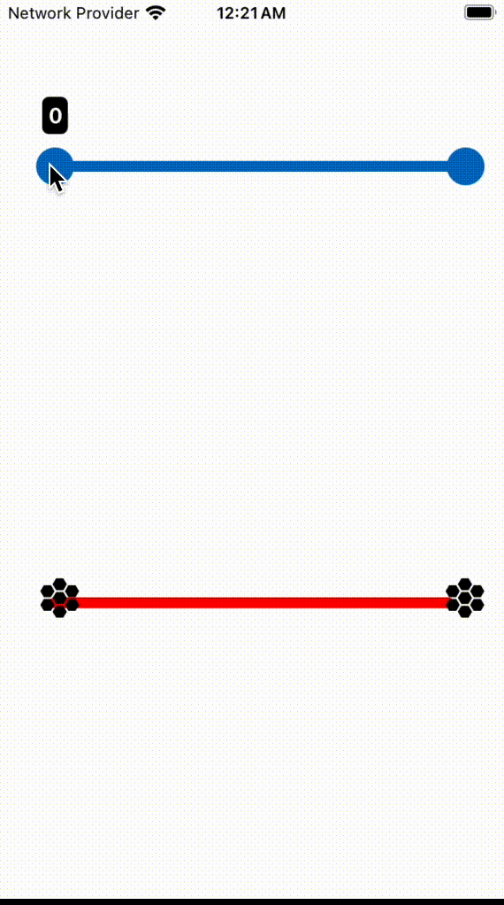
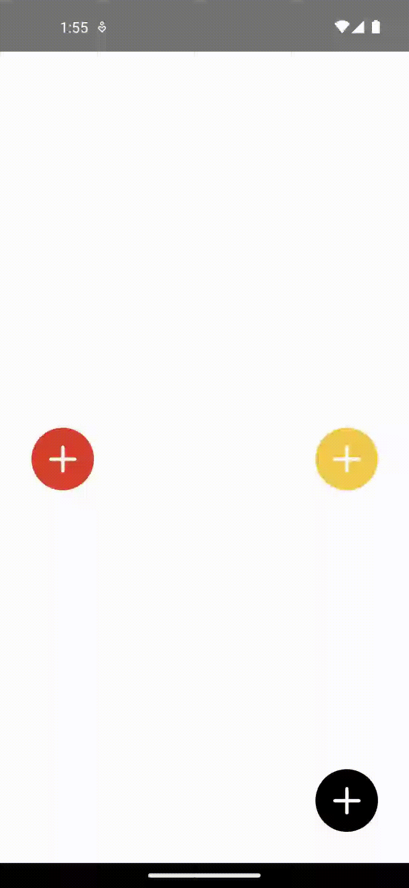
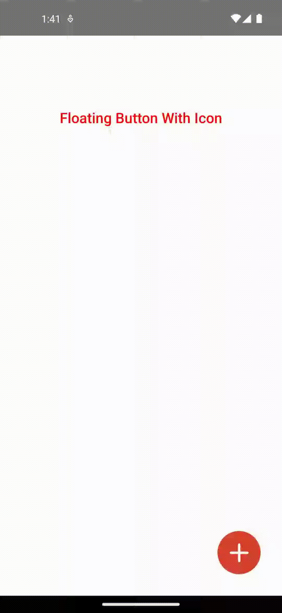
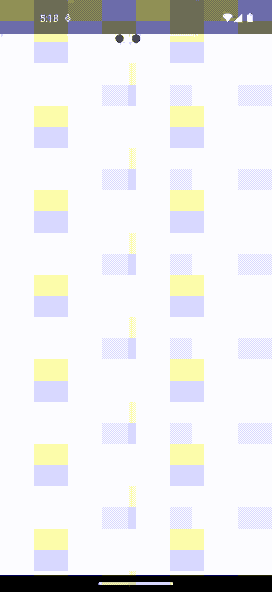

# react-native-vs-animated-component

Tired of spending countless hours crafting complex animations for your React Native app? react-native-vs-animated-component is your solution. This library offers a collection of meticulously designed, pre-built components that seamlessly integrate animations into your app, enhancing user experience and developer efficiency.

## Key Benefits

**Accelerated Development:** Save time and effort by using pre-built components with built-in animations.

**Enhanced User Experience:** Create engaging and interactive apps with visually appealing animations.

**Consistent Design:** Maintain a cohesive look and feel throughout your app with standardized components.

**Performance Optimized:** Components are designed for optimal performance using React Native's Animated API.

## Key Components

Slider | Progress bar | Infinite progress bar | Floating button | Select | Accordion | Modal | Icon Transition button | Swipe button | Progress button | Spring button | Tri-dot loader | Search bar | Timer

;
;
;
;
;
;
;


## Installation:

> Note: This package requires **[@react-native-reanimated](https://www.npmjs.com/package/react-native-reanimated)**

```bash
npm install react-native-vs-animated-component --save
```

OR

```bash
yarn add react-native-vs-animated-component --save
```

# Slider

## Single Value Slider



## Features

- **Customizable Styles:** Styles can be customized via props.
- **Responsive Design:** Adjusts to screen dimensions to maintain consistent behavior across devices.

## Usage

```jsx
import Slider from 'react-native-animated-components'
import Icon from 'react-native-vector-icons/MaterialIcons'

const Component = () => {
  const [value, setValue] = useState(0)

  return (
    <View>
      <Slider.SingleValue setValue={setValue} />
      <Slider.SingleValue
        setValue={setValue}
        thumbIcon={<Icon name="hive" size={35} color="black" />}
        activeTrackStyle={{ backgroundColor: 'red' }}
        inactiveTrackStyle={{ backgroundColor: 'plum' }}
      />
    </View>
  )
}
```

## Props

| Prop               | Type                                           | Description                                                                                        |
| ------------------ | ---------------------------------------------- | -------------------------------------------------------------------------------------------------- |
| activeTrackStyle   | `Omit<ViewStyle, 'width'>`                     | It is an optional prop that specifies the styles of the active track of the slider.                |
| duration           | `number`                                       | It is an optional prop which specifies the duration of animation in milliseconds.                  |
| inactiveTrackStyle | `Omit<ViewStyle, 'width'> `                    | It is an optional prop that specifies the styles of the inactive track of the slider.              |
| max                | `number`                                       | It is an optional prop that specifies the maximum possible value for the slider.                   |
| min                | `number`                                       | It is an optional prop that specifies the minimum possible value for the slider.                   |
| setValue           | `React.Dispatch<React.SetStateAction<number>>` | It is a required prop which updates the value state for the slider.                                |
| sliderHeight       | `number`                                       | It is an optional prop that specifies the height of the slider.                                    |
| sliderWidth        | `number`                                       | It is an optional prop that specifies the width of the slider.                                     |
| step               | `number`                                       | It is an optional prop that specifies the increment or decrement in the slider value when sliding. |
| thumbIcon          | `React.ReactNode`                              | It is an optional prop that specifies the icon for the slider thumb.                               |
| thumbSize          | `number`                                       | It is an optional prop that specifies the size of the slider thumb.                                |
| thumbStyle         | `ViewStyle`                                    | It is an optional prop that specifies the styles of the slider thumb.                              |
| value              | `number`                                       | It is an optional prop that specifies the current value of slider.                                 |

<br/>
<br/>

## Range Slider



## Features

- **Customizable Styles:** Styles can be customized via props.
- **Responsive Design:** Adjusts to screen dimensions to maintain consistent behavior across devices.

## Usage

```jsx
import Slider from 'react-native-animated-components'
import Icon from 'react-native-vector-icons/MaterialIcons'

const Component = () => {
  const [minValue, setMinValue] = useState(0)
  const [maxValue, setMaxValue] = useState(100)

  return (
    <View>
      <Slider.Range setMinValue={setMinValue} setMaxValue={setMaxValue} />
      <Slider.Range
        setMinValue={setMinValue}
        setMaxValue={setMaxValue}
        thumbIcon={<Icon name="hive" size={35} color="black" />}
        activeTrackStyle={{ backgroundColor: 'red' }}
        inactiveTrackStyle={{ backgroundColor: 'plum' }}
      />
    </View>
  )
}
```

## Props

| Prop               | Type                                           | Description                                                                                        |
| ------------------ | ---------------------------------------------- | -------------------------------------------------------------------------------------------------- |
| activeTrackStyle   | `Omit<ViewStyle, 'width'>`                     | It is an optional prop that specifies the styles of the active track of the slider.                |
| duration           | `number`                                       | It is an optional prop which specifies the duration of animation in milliseconds.                  |
| inactiveTrackStyle | `Omit<ViewStyle, 'width'>`                     | It is an optional prop that specifies the styles of the inactive track of the slider.              |
| max                | `number`                                       | It is an optional prop that specifies the maximum possible value for the slider.                   |
| maxValue           | `number`                                       | It is an optional prop that specifies the current maximum value for the slider.                    |
| min                | `number`                                       | It is an optional prop that specifies the minimum possible value for the slider.                   |
| minValue           | `number`                                       | It is an optional prop that specifies the current minimum value for the slider.                    |
| onMaxValSwipeEnd   | `React.Dispatch<React.SetStateAction<number>>` | It is a required prop which sets the maximum value for the slider.                                 |
| onMinValSwipeEnd   | `React.Dispatch<React.SetStateAction<number>>` | It is a required prop which updates the minimum value state for the slider.                        |
| sliderHeight       | `number`                                       | It is an optional prop that specifies the height of the slider.                                    |
| sliderWidth        | `number`                                       | It is an optional prop that specifies the width of the slider.                                     |
| step               | `number`                                       | It is an optional prop that specifies the increment or decrement in the slider value when sliding. |
| thumbIcon          | `React.ReactNode`                              | It is an optional prop that specifies the icon for the slider thumb.                               |
| thumbSize          | `number`                                       | It is an optional prop that specifies the size of the slider thumb.                                |
| thumbStyle         | `ViewStyle`                                    | It is an optional prop that specifies the styles of the slider thumb.                              |

<br>
<br>

# Progress Bar

## Linear Progress Bar

- It shows progress in form of a linear bar


## Features

- **Responsive Design:** Adjusts to screen dimensions to maintain consistent behavior across devices.
- **Fully customizable:** Each element of progress bar can be customized by props.

## Usage

```jsx
import ProgressBar from 'react-native-animated-components'

const Component = () => {
  const [progress, setProgress] = useState(0)

  useEffect(() => {
    const interval = setInterval(() => {
      setProgress(prevProgress => {
        const newProgress = prevProgress + 10
        return newProgress > 100 ? 0 : newProgress
      })
    }, 1000)

    return () => clearInterval(interval)
  }, [])

  return <ProgressBar.Linear value={progress} maxValue={100} />
}
```

## Props

| Prop           | Type                                      | Description                                                                                  |
| -------------- | ----------------------------------------- | -------------------------------------------------------------------------------------------- |
| containerStyle | Omit<ViewStyle, 'width'> & {width:number} | It is an optional prop which states the styles for progress bar container.                   |
| containerWidth | number                                    | It is an optional prop which states width for progress bar container.                        |
| duration       | number                                    | It is an optional prop which states the duration in milliseconds for the progress animation. |
| fillStyle      | Omit<ViewStyle, 'width'> & {width:number} | It is an optional prop which states the styles for the filled portion of the progress bar.   |
| labelStyle     | TextStyle                                 | It is an optional prop which states the styles for the progress label.                       |
| maxValue       | number                                    | It is an optional prop which states the maximum value of progress bar.                       |
| showLabel      | boolean                                   | It is an optional prop which states whether the percentage label will be be visible or not.  |
| value          | number                                    | It is a required prop which states the progress value.                                       |

<br/>
<br/>

## Circular Progress Bar

- It shows progress in form of a circular bar


## Features

- **Responsive Design:** Adjusts to screen dimensions to maintain consistent behavior across devices.
- **Fully customizable:** Each element of progress bar can be customized by props.

## Usage

```jsx
import ProgressBar from 'react-native-animated-components'

const Component = () => {
  const [progress, setProgress] = useState(0)

  useEffect(() => {
    const interval = setInterval(() => {
      setProgress(prevProgress => {
        const newProgress = prevProgress + 10
        return newProgress > 100 ? 0 : newProgress
      })
    }, 1000)

    return () => clearInterval(interval)
  }, [])

  return <ProgressBar.Circular value={progress} maxValue={100} />
}
```

## Props

| Prop              | Type      | Description                                                                                              |
| ----------------- | --------- | -------------------------------------------------------------------------------------------------------- |
| duration          | number    | It is an optional prop which states the duration of the animation in milliseconds.                       |
| labelStyle        | TextStyle | It is an optional prop which states the styles for the label displayed within the circular progress bar. |
| maxValue          | number    | It is an optional prop which states the maximum value for the progress bar.                              |
| outerRingColor    | string    | It is an optional prop which states the color of the outer ring of the circular progress bar.            |
| progressRingColor | string    | It is an optional prop which states the color of the progress ring.                                      |
| showLabel         | boolean   | It is an optional prop which states whether the percentage label will be be visible or not.              |
| size              | number    | It is an optional prop which states the overall width , height of circular progress bar.                 |
| strokeWidth       | number    | It is an optional prop which states the stroke width of the progress ring.                               |
| value             | number    | It is a required prop which states the current progress value.                                           |

<br/>
<br/>

## Infinite Linear Progress Bar

- It provides an animated, continuously progressing bar to indicate loading.


## Features

- **Responsive Design:** Adjusts to screen dimensions to maintain consistent behavior across devices.
- **Fully customizable:** Each element of progress bar can be customized by props.

## Usage

```jsx
import ProgressBar from 'react-native-animated-components'

const Component = () => {
  return <ProgressBar.InfiniteLinear />
}
```

## Props

| Prop           | Type                                      | Description                                                                                |
| -------------- | ----------------------------------------- | ------------------------------------------------------------------------------------------ |
| containerStyle | Omit<ViewStyle, 'width'> & {width:number} | It is an optional prop which states the styles for the progress bar container.             |
| containerWidth | number                                    | It is an optional prop which states the width for the progress bar container.              |
| duration       | number                                    | It is an optional prop which states the duration of the animation in milliseconds.         |
| fillStyle      | Omit<ViewStyle, 'width'> & {width:number} | It is an optional prop which states the styles for the filled portion of the progress bar. |
| fillWidth      | number                                    | It is an optional prop which states the width for the filled portion of the progress bar.  |

<br/>
<br/>

## Infinite Circular Progress Bar

- It provides an provides a continuous, animated circular indicator for loading.


## Features

- **Responsive Design:** Adjusts to screen dimensions to maintain consistent behavior across devices.
- **Fully customizable:** Each element of progress bar can be customized by props.

## Usage

```jsx
import ProgressBar from 'react-native-animated-components'

const Component = () => {
  return <ProgressBar.InfiniteCircular />
}
```

## Props

| Prop              | Type   | Description                                                                                    |
| ----------------- | ------ | ---------------------------------------------------------------------------------------------- |
| duration          | number | It is an optional prop which states the duration of the animation in milliseconds.             |
| outerRingColor    | string | It is an optional prop which states the color of the outer ring of the circular progress bar.  |
| progressRingColor | string | It is an optional prop which states the color of the progress ring.                            |
| size              | number | It is an optional prop which states the overall width and height of the circular progress bar. |
| strokeWidth       | number | It is an optional prop which states the stroke width of the progress ring.                     |

<br>
<br>

# Floating Button

### Floating Button All Variants



<br/>

### Floating Button With Icon



<br/>

### Floating Button With Label


<br/>

### Circular Floating Button


## Features

- **Different Types:** Allows users to choose the type of floating button.
- **Animation Transition Duration**: Control the duration of the opening/closing animation.
- **Responsive Design**: Adjusts to screen dimensions to maintain consistent behavior across devices.
- **Customizable Styles**: Styles can be customized via props.
- **Circular Floating Button**: Offers a circular expansion with animated icons along the circumference.
- **Floating Button With Icon**: Provides a vertical stack of icons with staggered animations.
- **Floating Button With Label**: Similar to FloatingButtonWithIcon but includes expanding width and text labels for each icon.

## Usage

```jsx
import FloatingButton from "react-native-animated-components";

const icons = [
    {
      icon: FileIcon,
      onPress: () => Alert.alert('File Icon Pressed'),
      iconName: 'File',
    },
    {
      icon: FolderIcon,
      onPress: () => Alert.alert('Folder Icon Pressed'),
      iconName: 'Folder',
    },
    {
      icon: PenIcon,
      onPress: () => Alert.alert('Pen Icon Pressed'),
      iconName: 'Pen',
    },
    {
      icon: PenIcon,
      onPress: () => Alert.alert('Pen Icon Pressed'),
      iconName: 'Pencil',
    },
  ]

  <FloatingButton buttonType={FloatingButtonPreset.FloatingButtonWithIcon} icons={icons} />
```

| Prop                        | Type                 | Values                                                                    | Description                                                                                                                          |
| --------------------------- | -------------------- | ------------------------------------------------------------------------- | ------------------------------------------------------------------------------------------------------------------------------------ |
| animationTransitionDuration | number               | 0,1,2,3.....                                                              | It is used to change the duration of the transition of animation.                                                                    |
| buttonContainerStyle        | ViewStyle            | name of style class created                                               | It is used to change the styles of the container of the floating button.                                                             |
| buttonType                  | FloatingButtonPreset | FloatingButtonWithIcon / FloatingButtonWithLabel / CircularFloatingButton | It is used to change the type of the floating button.                                                                                |
| circleStyle                 | ViewStyle            | name of style class created                                               | It is used to change the styles of the container of the expanding circle when the type of floating button is CircularFloatingButton. |
| contentContainerStyle       | ViewStyle            | name of style class created                                               | It is used to change the styles of the container of the content in the floating button.                                              |
| iconContainerStyle          | ViewStyle            | name of style class created                                               | It is used to change the styles of the container of the icon in the floating button.                                                 |
| iconStyle                   | ImageStyle           | name of style class created                                               | It is used to change the styles of the icons in the floating button.                                                                 |
| icons                       | array of IconProps   | { icon: 'name of image', onPress: function, iconName: 'name of icon'}     | It is used to pass the name, image and function the for the icon.                                                                    |
| isLeftAligned               | Boolean              | true/false                                                                | It is used to change the position of the floating button to left when true otherwise right.                                          |
| textStyle                   | TextStyle            | name of style class created                                               | It is used to change the styles of the text when the type of floating button is FloatingButtonWithLabel.                             |

**Note:** All the props are passed to the floating-button component from where it will send the props to the type chosen by the user.

<br/>
<br/>

# Select


## Features

- **Animation Transition Duration:** Control the duration of the opening/closing animation.
- **Customizable Styles:** Styles can be customized via props.
- **Different Types:** Allows users to choose the type of select box.
- **Dropdown Selection:** Opens a dropdown interface to select options.
- **Performance Optimizations:** Only renders the dropdown and animations when needed, reducing unnecessary re-renders.
- **Responsive Design:** Adjusts to screen dimensions to maintain consistent behavior across devices.
- **Single/Multi-selection:** Supports both single and multi-select use cases with the same component, reducing the need for multiple components.
- **TypeScript Support:** Fully typed with TypeScript, providing type safety and better developer experience.

```jsx
import Select from "react-native-animated-components";

const [select, setSelect] = useState<ISelectOption | ISelectOption[]>([])

<Select
  onChange={setSelect}
  options={[
    { title: "Amandeep", value: "amandeep" },
    { title: "Aman Rana", value: "aman rana" },
    { title: "Hargun", value: "hargun" },
    { title: "Ravi", value: "ravi" },
  ]}
  selectedOptions={select}
  placeholderText="Select option"
/>
```

| Prop                 | Type                                              | Values                                                         | Description                                                                                     |
| -------------------- | ------------------------------------------------- | -------------------------------------------------------------- | ----------------------------------------------------------------------------------------------- |
| multiSelect          | Boolean                                           | true/false                                                     | It is is an optional prop which dictates whether multiple selections is allowed or not.         |
| onChange             | (newValue: ISelectOption[]/ISelectOption) => void | name of function to perform                                    | It is a required prop which dictates the function which will be called on clicking the options. |
| options              | Array of { title: '', value: '' }                 | [{ title: 'Name to be displayed', value: 'Value to be used' }] | It is an required prop which dictates an array containing titles and values for options.        |
| optionContainerStyle | ViewStyle                                         | name of style class created                                    | It is an optional prop which defines the styles of option container.                            |
| optionStyle          | ViewStyle                                         | name of style class created                                    | It is an optional prop which defines the styles of options.                                     |
| placeholderText      | string                                            | values to be display in select box                             | It is an optional prop which dictates the text of placeholder.                                  |
| selectedOptionStyle  | ViewStyle                                         | name of style class created                                    | It is an optional prop which defines the styles of selected option.                             |
| selectContainerStyle | ViewStyle                                         | name of style class created                                    | It is an optional prop which defines the styles of select container.                            |
| selectedOptions      | ISelectOption[]/ISelectOption                     | [{ title: 'Name to be displayed', value: 'Value to be used' }] | It is a required prop which dictates the selected options.                                      |

**Note:** All the props are passed to the select component.

<br/>
<br/>

# Accordion

The Accordion component lets users show and hide sections of related content on a page.


## Features

- **Animation Transition Duration:** Control the duration of the opening/closing animation.
- **Customizable Styles:** Styles can be customized via props.
- **Single open:** Allows users to choose the if multiple accordions will be open or only single accordion will be open at a time.

## Usage

```jsx
<Accordion showSingleItemAtOnce={false}>
  <Accordion.Item id={1} title="FAQ">
    <View style={{ padding: 20, backgroundColor: '#E8C5E5' }}>
      <Text style={{ fontFamily: 'Robot-Medium', letterSpacing: 1 }}>
        Lorem ipsum dolor sit amet consectetur adipisicing elit. Dolore officia nostrum libero
        similique iste cumque, perspiciatis quasi exercitationem, suscipit voluptatum autem, fuga
        maiores? Saepe, vitae perspiciatis. Cumque consequatur facilis incidunt.
      </Text>
    </View>
  </Accordion.Item>
  <Accordion.Item id={2} title="FAQ">
    <View style={{ padding: 20, backgroundColor: '#E8C5E5' }}>
      <Text style={{ fontFamily: 'Robot-Medium', letterSpacing: 1 }}>
        Lorem ipsum dolor sit amet consectetur adipisicing elit. Dolore officia nostrum libero
        similique iste cumque, perspiciatis quasi exercitationem, suscipit voluptatum autem, fuga
        maiores? Saepe, vitae perspiciatis. Cumque consequatur facilis incidunt.
      </Text>
    </View>
  </Accordion.Item>
  <Accordion.Item id={3} title="FAQ">
    <View style={{ padding: 20, backgroundColor: '#E8C5E5' }}>
      <Text style={{ fontFamily: 'Robot-Medium', letterSpacing: 1 }}>
        Lorem ipsum dolor sit amet consectetur adipisicing elit. Dolore officia nostrum libero
        similique iste cumque, perspiciatis quasi exercitationem, suscipit voluptatum autem, fuga
        maiores? Saepe, vitae perspiciatis. Cumque consequatur facilis incidunt.
      </Text>
    </View>
  </Accordion.Item>
</Accordion>
```

## Accordion Item Props

| Prop                | Type             | Description                                                                                                                                       |
| ------------------- | ---------------- | ------------------------------------------------------------------------------------------------------------------------------------------------- |
| title               | string           | It dictates the title of the accordion.                                                                                                           |
| titleStyle          | DefaultStyle     | It is an optional prop which is used to allow users to change the style of title text.                                                            |
| isDefaultOpen       | boolean          | It is an optional prop which is used to dictate whether the accordion will be open by default. Only works when showSingleItemAtOnce prop is false |
| icon                | string           | It is used to dictate the icon name from the ant design library for the accordion dropdown.                                                       |
| id                  | number or string | It is used to define the id of the accordion item.                                                                                                |
| titleContainerStyle | DefaultStyle     | It is an optional prop which is used to allow users to change the style of title container.                                                       |

## Accordion Props

| Prop                 | Type    | Description                                                                                     |
| -------------------- | ------- | ----------------------------------------------------------------------------------------------- |
| duration             | number  | It is used to control the speed of the animation.                                               |
| showSingleItemAtOnce | boolean | It is an optional prop which dictates if multiple accordion items can be open at the same time. |

<br/>
<br/>

# Modal


## Features:

1. Multiple modal animations:
   - Fade-In
   - Slide-In
   - Scale
   - Slide-In-Left
2. Easy to integrate and use in any React Native project.
3. Customizable modal content and styles.

## Props:

The component accepts the following props:
|Prop |Type |Description |Required |
|--- |--- |--- | ---|
| isVisible | boolean | Indicates whether the modal is visible or not | Yes |
| onClose | () => {} | Handles the closing of the modal | Yes |
| type | ModalPreset | Specifies the type of animation preset for the modal | Yes |
| children | React.ReactNode | The content to be displayed inside the modal | Yes |
| style | StyleProp<ViewStyle> | Additional styles for customizing the modal | No |

## Usage:

This is a simple example of how to use animated modals:

```Typescript

const App: React.FC = () => {
  const [fadeInVisible, setFadeInVisible] = useState(false);

  return (
    <GestureHandlerRootView style={{ flex: 1 }}>
      <View style={styles.container}>
        <TouchableOpacity onPress={() => setFadeInVisible(true)} style={styles.button}>
          <Text style={styles.buttonText}>Show Fade-In Modal</Text>
        </TouchableOpacity>

        <Modal
          isVisible={fadeInVisible}
          onClose={() => setFadeInVisible(false)}
          type={ModalPreset.FadeIn}>
          <Text>This is a fade-in modal</Text>
        </Modal>
      </View>
    </GestureHandlerRootView>
  );
};

const styles = StyleSheet.create({
  container: {
    flex: 1,
    justifyContent: 'center',
    alignItems: 'center',
  },
  button: {
    padding: 10,
    backgroundColor: '#007bff',
    borderRadius: 5,
    marginBottom: 10,
  },
  buttonText: {
    color: '#fff',
  },
});

export default App;

```

<br/>
<br/>

# Icon Transition Button


## Features

- **Customizable Styles:** Styles can be customized via props.
- **Flexibility:** Highly flexible with support for custom icons and labels for different states (start, success, failure). This makes it adaptable to various use cases.
- **Multiple States Handling:** Efficiently handles various states such as success and failure. This can be particularly useful for forms or any action that requires feedback based on the result of an asynchronous operation.
- **Responsive Design:** Adjusts to screen dimensions to maintain consistent behavior across devices.
- **Smooth Transition Animations:** Provide smooth and visually appealing transition animations for icons and labels. This can enhance the user experience significantly.

## Usage

```jsx
import IconTransitionButton from 'react-native-animated-components'

;<IconTransitionButton
  onPress={async () => {
    // Perform some async operation
    const success = await someAsyncFunction()
    return success
  }}
  startIcon={<StartIconComponent />}
  failedLabel="Payment Failed"
  startLabel="Make Payment"
  successLabel="Payment Successful"
  failedIcon={<FailedIconComponent />}
  successIcon={<SuccessIconComponent />}
  isDisabled={false}
  isLoading={false}
/>
```

| Prop         | Type                                 | Values                      | Description                                                                                                 |
| ------------ | ------------------------------------ | --------------------------- | ----------------------------------------------------------------------------------------------------------- |
| buttonStyle  | ViewStyle                            | name of style class created | It is an optional prop which defines the styles of button.                                                  |
| failedIcon   | React.ReactNode                      | icon as component           | It is a required prop which dictates the icon displayed if the onPress function returns a falsy value.      |
| failedLabel  | String                               | text                        | It is a required prop which dictates the label to be displayed when transition fails                        |
| isDisabled   | boolean                              | true/false                  | It is an optional prop which dictates that disables the button if true.                                     |
| isLoading    | boolean                              | true/false                  | It is an optional prop which dictates that disables the button if true, likely to indicate a loading state. |
| onPress      | () => void / boolean / Promise<void> | name of function to perform | It is a required prop which dictates the function is called when the button is pressed.                     |
| startIcon    | React.ReactNode                      | icon as component           | It is a required prop which dictates the initial icon displayed on the button.                              |
| startLabel   | String                               | text                        | It is a required prop which dictates the label to be displayed initially.                                   |
| successIcon  | React.ReactNode                      | icon as component           | It is a required prop which dictates the icon displayed if the onPress function returns a truth value.      |
| successLabel | String                               | text                        | It is a required prop which dictates the label to be displayed when transition succeeds                     |

**Note:** All the props are passed to the Icon Transition Button component.

<br/>
<br/>

# Swipe Button


## Features

- **Responsive Design:** Adjusts to screen dimensions to maintain consistent behavior across devices.
- **Customizable Styles:** Styles can be customized via props.

## Usage

```jsx
import SwipeButton from 'react-native-animated-components'

const gradientWaveColor = useMemo(() => ['#1A63C5', '#1A63C5'], [])
const thumbColors = useMemo(() => ['#1A63C5', '#1A63C5'], [])

const taskStatusData = useMemo(
  () => ({
    fail: {
      text: 'Failed',
      icon: RemixIcons.FILLED_CLOSE_CIRCLE,
      iconColor: 'white',
      waveColor: ['#D54D49', '#D54D49'],
    },
    success: {
      text: 'Successfully',
      icon: RemixIcons.CHECKBOX_CIRCLE_FILLED,
      iconColor: 'white',
      waveColor: ['#59B359', '#59B359'],
    },
  }),
  [],
)

const handleSubmitBtnPress = () => {
  try {
    return true
  } catch {
    return false
  }
}

;<SwipeButton
  buttonInitialText="Swipe to complete"
  gradientWaveColor={['#4c669f', '#3b5998', '#192f6a']}
  isDisabled={false}
  onSwipeComplete={async () => {
    // Simulate async operation
    const success = await someAsyncOperation()
    return success
  }}
  onTaskComplete={isSuccess => {
    // Handle task completion
    console.log('Task completed:', isSuccess)
  }}
  taskStatusData={{
    success: { waveColor: ['#00ff00'] },
    fail: { waveColor: ['#ff0000'] },
  }}
  thumbColors={['#ffffff', '#000000']}
/>
```

## Props

| Prop              | Type                         | Values                      | Description                                                                                            |
| ----------------- | ---------------------------- | --------------------------- | ------------------------------------------------------------------------------------------------------ |
| buttonInitialText | string                       | text                        | It is a required prop which defines the initial text displayed on the button.                          |
| gradientWaveColor | Array<string>                | array of colors             | It is a required prop which defines the colors for the initial gradient wave effect.                   |
| isDisabled        | boolean                      | true/false                  | It is an optional prop which disables the button if true.                                              |
| onSwipeComplete   | () => Promise<boolean>       | name of function to perform | It is a required prop which dictates the function called when the swipe is completed.                  |
| onTaskComplete    | (isSuccess: boolean) => void | name of function to perform | It is a required prop which dictates the function called when the task is complete.                    |
| style             | ViewStyle                    | name of style class created | It is an optional prop which defines the styles of the button.                                         |
| taskStatusData    | ITaskStatusData              | object                      | It is a required prop which provides data related to task statuses, including success and fail states. |
| thumbColors       | Array<string>                | array of colors             | It is a required prop which defines the colors for the thumb (swipe indicator).                        |

**Note:** All the props are passed to the Swipe Button component.

<br/>
<br/>

# Progress Button


## Features

- **Responsive Design:** Adjusts to screen dimensions to maintain consistent behavior across devices.
- **Customizable Styles:** Styles can be customized via props.

## Usage

```jsx
import ProgressButton from 'react-native-animated-components'

const [isLoading, setIsLoading] = useState(false)

const onPress = () => {
  setIsLoading(true)
  setTimeout(() => setIsLoading(false), 3000)
}

;<ProgressButton
  isLoading={isLoading}
  onPress={onPress}
  label="Submit"
  buttonContainerStyle={{
    marginVertical: 20,
  }}
/>
```

## Props

| Prop                 | Type                 | Values                      | Description                                                                                  |
| -------------------- | -------------------- | --------------------------- | -------------------------------------------------------------------------------------------- |
| buttonContainerStyle | StyleProp<ViewStyle> | name of style class created | It is an optional prop which defines the styles of the button container.                     |
| buttonStyle          | StyleProp<ViewStyle> | name of style class created | It is an optional prop which defines the styles of the button.                               |
| isDisabled           | boolean              | true/false                  | It is an optional prop which disables the button if true.                                    |
| isLoading            | boolean              | true/false                  | It is a required prop which indicates the loading state of the button.                       |
| label                | string               | text                        | It is a required prop which defines the label text displayed on the button.                  |
| labelStyle           | StyleProp<TextStyle> | name of style class created | It is an optional prop which defines the styles of the label text.                           |
| loadingText          | string               | text                        | It is an optional prop which defines the text displayed when the button is in loading state. |
| onPress              | () => void           | name of function to perform | It is a required prop which dictates the function called when the button is pressed.         |

**Note:** All the props are passed to the Progress Button component.

<br/>
<br/>

# Spring Button


## Features

- **Responsive Design:** Adjusts to screen dimensions to maintain consistent behavior across devices.
- **Customizable Styles:** Styles can be customized via props.

## Usage

```jsx
import SpringButton from 'react-native-animated-components'

const onPress = () => {
  console.log('Button Pressed')
}

;<SpringButton label="Press me" onPress={onPress} />
```

## Props

| Prop              | Type                 | Values                      | Description                                                                                       |
| ----------------- | -------------------- | --------------------------- | ------------------------------------------------------------------------------------------------- |
| customButtonStyle | StyleProp<ViewStyle> | name of style class created | It is an optional prop which defines the custom styles of the button.                             |
| isLoading         | boolean              | true/false                  | It is an optional prop which indicates the loading state of the button.                           |
| isDisabled        | boolean              | true/false                  | It is an optional prop which disables the button if true.                                         |
| label             | string               | text                        | It is a required prop which defines the label text displayed on the button.                       |
| loaderColor       | string               | color code                  | It is an optional prop which defines the color of the loader when the button is in loading state. |
| onPress           | () => void           | name of function to perform | It is a required prop which dictates the function called when the button is pressed.              |

**Note:** All the props are passed to the Spring Button component.

<br/>
<br/>

# Tri-Dot Loader



## Features

- **Responsive Design:** Adjusts to screen dimensions to maintain consistent behavior across devices.
- **Customizable Styles:** Styles can be customized via props.

## Usage

```jsx
import TriDotLoader from 'react-native-animated-components'

;<TriDotLoader loaderPreset={TriDotLoaderPreset.Large} />
```

## Props

| Prop              | Type                 | Values                      | Description                                                                     |
| ----------------- | -------------------- | --------------------------- | ------------------------------------------------------------------------------- |
| customLoaderStyle | StyleProp<ViewStyle> | name of style class created | It is an optional prop which defines the custom styles of the loader.           |
| loaderDotColor    | string               | color code                  | It is an optional prop which defines the color of the dots in the loader.       |
| loaderPreset      | TriDotLoaderPreset   | Small / Medium / Large      | It is an optional prop which defines the size preset of the dots in the loader. |

**Note:** All the props are passed to the Tri-Dot Loader component.

<br/>
<br/>

# Search Bar

The Search Bar component is an expandable search bar component which can expand and collapse by clicking on search icon.

# Preview


## Features

- **Animation Transition Duration:** Control the duration of the opening/closing animation.
- **Customizable Styles:** Styles can be customized via props.
- **Icon Selection:** Allows users to choose their own icons.
- **Performance Optimizations:** Only renders the dropdown and animations when needed, reducing unnecessary re-renders.

## Props

| Prop                        | Type                   | Description                                                                                    |
| --------------------------- | ---------------------- | ---------------------------------------------------------------------------------------------- |
| **CloseIcon**               | React.ReactNode        | It is an optional prop which holds the icon to be displayed to close the search bar.           |
| **duration**                | number                 | It is an optional prop which indicates the duration of the animation.                          |
| **iconSize**                | number                 | It is an optional prop which indicates the size of the icon.                                   |
| **iconStyle**               | DefaultStyle           | It is an optional prop which holds the style of the search icon.                               |
| **inputContainerStyle**     | DefaultStyle           | It is an optional prop which holds the style of the input container.                           |
| **handleInputChange**       | (text: string) => void | It is a prop which handles the input change.                                                   |
| **height**                  | number                 | It is an optional prop which indicates the height of the search bar.                           |
| **iconBackgroundColor**     | string                 | It is an optional prop which indicates the color of the icon background.                       |
| **iconColor**               | string                 | It is an optional prop which indicates the color of the icon.                                  |
| **placeholderText**         | string                 | It is an optional prop which holds the placeholder text.                                       |
| **placeholderTextColor**    | string                 | It is an optional prop which holds the placeholder text color.                                 |
| **searchBarContainerStyle** | DefaultStyle           | It is an optional prop which holds the style of the search bar.                                |
| **SearchIcon**              | React.ReactNode        | It is an optional prop which holds the icon to be displayed.                                   |
| **searchValue**             | string                 | It is a prop which holds the value of the search bar.                                          |
| **wrapperContainerStyle**   | DefaultStyle           | It is an optional prop which holds the style of the main container which wraps the search bar. |

# Timer

https://github.com/user-attachments/assets/d84c2673-4d8b-46c7-b714-449ba7f4b016

## Features

- **Customizable**: Easily style the timer and its control buttons.
- **Dual Timer Types**: Supports both linear and circular timers.
- **Controls**: Optional start, pause, resume, and reset controls.
- **Animations**: Smooth animations

## Props

| Prop               | Type                                        | Default Value                   | Required | Description                                                    |
| ------------------ | ------------------------------------------- | ------------------------------- | -------- | -------------------------------------------------------------- |
| buttonStyles       | { container?: ViewStyle; text?: TextStyle } | -                               | No       | Custom styles for the timer control buttons                    |
| circularDimensions | { radius?: number; strokeWidth?: number }   | { radius: 45, strokeWidth: 10 } | No       | indicates the radius and stroke width of the circular timer    |
| controls           | boolean                                     | false                           | No       | Determines if control buttons (Start, Pause, Reset) are shown  |
| duration           | number                                      | -                               | Yes      | Total duration of the timer in seconds                         |
| linearDimenions    | { width?: number; height?: number }         | { width: 300, height: 10 }      | Yes      | Indicates the width and height of the linear timer             |
| showTimeLeft       | boolean                                     | true                            | No       | Indicates whether to display time left on screen or not        |
| strokeColor        | string                                      | black                           | No       | Indicates the color of timer                                   |
| timeLeftTextStyle  | TextSTyle                                   | -                               | No       | Prop to style the time left text of the timer                  |
| type               | TimerPreset                                 | -                               | Yes      | Type of the timer (TimerPreset.Linear or TimerPreset.Circular) |

## Usage

```typescript
import React from 'react'

import Timer from '@components'
import { TimerPreset } from '@constants'

const App = () => {
  return (
    <Timer
      buttonStyles={{
        container: { backgroundColor: 'blue' },
        text: { color: 'white' },
      }}
      circularTimerStrokeColor="red"
      controls={true}
      linearTimerColor="green"
      timerType={TimerPreset.Circular} // or TimerPreset.Linear
      totalDurationInSeconds={60}
    />
  )
}

export default App
```
