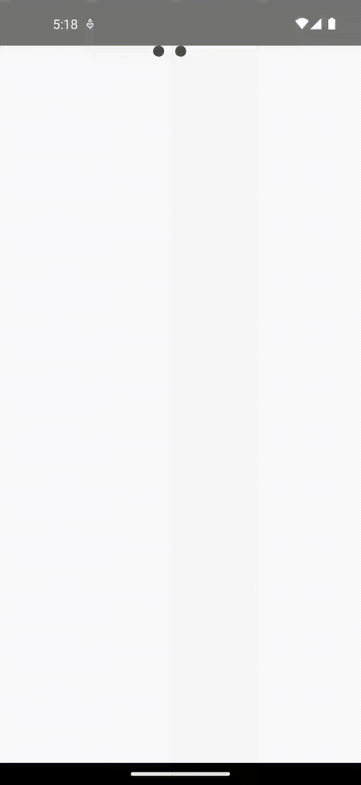

# react-native-vs-animated-component

# Accordion

The Accordion component lets users show and hide sections of related content on a page.

# Preview


## Usage

```jsx
<Accordion showSingleItemAtOnce={false}>
  <Accordion.Item id={1} title="FAQ">
    <View style={{ padding: 20, backgroundColor: "#E8C5E5" }}>
      <Text style={{ fontFamily: "Robot-Medium", letterSpacing: 1 }}>
        Lorem ipsum dolor sit amet consectetur adipisicing elit. Dolore officia
        nostrum libero similique iste cumque, perspiciatis quasi exercitationem,
        suscipit voluptatum autem, fuga maiores? Saepe, vitae perspiciatis.
        Cumque consequatur facilis incidunt.
      </Text>
    </View>
  </Accordion.Item>
  <Accordion.Item id={2} title="FAQ">
    <View style={{ padding: 20, backgroundColor: "#E8C5E5" }}>
      <Text style={{ fontFamily: "Robot-Medium", letterSpacing: 1 }}>
        Lorem ipsum dolor sit amet consectetur adipisicing elit. Dolore officia
        nostrum libero similique iste cumque, perspiciatis quasi exercitationem,
        suscipit voluptatum autem, fuga maiores? Saepe, vitae perspiciatis.
        Cumque consequatur facilis incidunt.
      </Text>
    </View>
  </Accordion.Item>
  <Accordion.Item id={3} title="FAQ">
    <View style={{ padding: 20, backgroundColor: "#E8C5E5" }}>
      <Text style={{ fontFamily: "Robot-Medium", letterSpacing: 1 }}>
        Lorem ipsum dolor sit amet consectetur adipisicing elit. Dolore officia
        nostrum libero similique iste cumque, perspiciatis quasi exercitationem,
        suscipit voluptatum autem, fuga maiores? Saepe, vitae perspiciatis.
        Cumque consequatur facilis incidunt.
      </Text>
    </View>
  </Accordion.Item>
</Accordion>
```

## Props

## Accordion Item Props

| Prop                | Type             | Description                                                                                                                                       |
| ------------------- | ---------------- | ------------------------------------------------------------------------------------------------------------------------------------------------- |
| title               | string           | It dictates the title of the accordion.                                                                                                           |
| titleStyle          | DefaultStyle     | It is an optional prop which is used to allow users to change the style of title text.                                                            |
| isDefaultOpen       | boolean          | It is an optional prop which is used to dictate whether the accordion will be open by default. Only works when showSingleItemAtOnce prop is false |
| icon                | string           | It is used to dictate the icon name from the ant design library for the accordion dropdown.                                                       |
| id                  | number or string | It is used to define the id of the accordion item.                                                                                                |
| titleContainerStyle | DefaultStyle     | It is an optional prop which is used to allow users to change the style of title container.                                                       |

## Accordion Props

| Prop                 | Type    | Description                                                                                     |
| -------------------- | ------- | ----------------------------------------------------------------------------------------------- |
| duration             | number  | It is used to control the speed of the animation.                                               |
| showSingleItemAtOnce | boolean | It is an optional prop which dictates if multiple accordion items can be open at the same time. |

<br/>
<br/>

# Modals

## Features:

1. Multiple modal animations:
   - Fade-In
   - Slide-In
   - Scale
   - Slide-In-Left
2. Easy to integrate and use in any React Native project.
3. Customizable modal content and styles.

## Preview


## Props:

The component accepts the following props:
|Prop |Type |Description |Required |
|--- |--- |--- | ---|
| isVisible | boolean | Indicates whether the modal is visible or not | Yes |
| onClose | () => {} | Handles the closing of the modal | Yes |
| type | ModalPreset | Specifies the type of animation preset for the modal | Yes |
| children | React.ReactNode | The content to be displayed inside the modal | Yes |
| style | StyleProp<ViewStyle> | Additional styles for customizing the modal | No |

## Usage:

This is a simple example of how to use animated modals:

```Typescript

const App: React.FC = () => {
  const [fadeInVisible, setFadeInVisible] = useState(false);

  return (
    <GestureHandlerRootView style={{ flex: 1 }}>
      <View style={styles.container}>
        <TouchableOpacity onPress={() => setFadeInVisible(true)} style={styles.button}>
          <Text style={styles.buttonText}>Show Fade-In Modal</Text>
        </TouchableOpacity>

        <Modal
          isVisible={fadeInVisible}
          onClose={() => setFadeInVisible(false)}
          type={ModalPreset.FadeIn}>
          <Text>This is a fade-in modal</Text>
        </Modal>
      </View>
    </GestureHandlerRootView>
  );
};

const styles = StyleSheet.create({
  container: {
    flex: 1,
    justifyContent: 'center',
    alignItems: 'center',
  },
  button: {
    padding: 10,
    backgroundColor: '#007bff',
    borderRadius: 5,
    marginBottom: 10,
  },
  buttonText: {
    color: '#fff',
  },
});

export default App;

```

# React Native Icon Transition Button

## Features

- **Customizable Styles:** Styles can be customized via props.
- **Flexibility:** Highly flexible with support for custom icons and labels for different states (start, success, failure). This makes it adaptable to various use cases.
- **Multiple States Handling:** Efficiently handles various states such as success and failure. This can be particularly useful for forms or any action that requires feedback based on the result of an asynchronous operation.
- **Responsive Design:** Adjusts to screen dimensions to maintain consistent behavior across devices.
- **Smooth Transition Animations:** Provide smooth and visually appealing transition animations for icons and labels. This can enhance the user experience significantly.

## Preview


## Usage

```jsx
import IconTransitionButton from "react-native-animated-components";

<IconTransitionButton
  onPress={async () => {
    // Perform some async operation
    const success = await someAsyncFunction();
    return success;
  }}
  startIcon={<StartIconComponent />}
  failedLabel="Payment Failed"
  startLabel="Make Payment"
  successLabel="Payment Successful"
  failedIcon={<FailedIconComponent />}
  successIcon={<SuccessIconComponent />}
  isDisabled={false}
  isLoading={false}
/>;
```

| Prop         | Type                                 | Values                      | Description                                                                                                 |
| ------------ | ------------------------------------ | --------------------------- | ----------------------------------------------------------------------------------------------------------- |
| buttonStyle  | ViewStyle                            | name of style class created | It is an optional prop which defines the styles of button.                                                  |
| failedIcon   | React.ReactNode                      | icon as component           | It is a required prop which dictates the icon displayed if the onPress function returns a falsy value.      |
| failedLabel  | String                               | text                        | It is a required prop which dictates the label to be displayed when transition fails                        |
| isDisabled   | boolean                              | true/false                  | It is an optional prop which dictates that disables the button if true.                                     |
| isLoading    | boolean                              | true/false                  | It is an optional prop which dictates that disables the button if true, likely to indicate a loading state. |
| onPress      | () => void / boolean / Promise<void> | name of function to perform | It is a required prop which dictates the function is called when the button is pressed.                     |
| startIcon    | React.ReactNode                      | icon as component           | It is a required prop which dictates the initial icon displayed on the button.                              |
| startLabel   | String                               | text                        | It is a required prop which dictates the label to be displayed initially.                                   |
| successIcon  | React.ReactNode                      | icon as component           | It is a required prop which dictates the icon displayed if the onPress function returns a truth value.      |
| successLabel | String                               | text                        | It is a required prop which dictates the label to be displayed when transition succeeds                     |

**Note:** All the props are passed to the Icon Transition Button component.

<br/>
<br/>

# React Native Swipe Button

## Preview


## Features

- **Responsive Design:** Adjusts to screen dimensions to maintain consistent behavior across devices.
- **Customizable Styles:** Styles can be customized via props.

## Usage

```jsx
import SwipeButton from "react-native-animated-components";

const gradientWaveColor = useMemo(() => ["#1A63C5", "#1A63C5"], []);
const thumbColors = useMemo(() => ["#1A63C5", "#1A63C5"], []);

const taskStatusData = useMemo(
  () => ({
    fail: {
      text: "Failed",
      icon: RemixIcons.FILLED_CLOSE_CIRCLE,
      iconColor: "white",
      waveColor: ["#D54D49", "#D54D49"],
    },
    success: {
      text: "Successfully",
      icon: RemixIcons.CHECKBOX_CIRCLE_FILLED,
      iconColor: "white",
      waveColor: ["#59B359", "#59B359"],
    },
  }),
  []
);

const handleSubmitBtnPress = () => {
  try {
    return true;
  } catch {
    return false;
  }
};

<SwipeButton
  buttonInitialText="Swipe to complete"
  gradientWaveColor={["#4c669f", "#3b5998", "#192f6a"]}
  isDisabled={false}
  onSwipeComplete={async () => {
    // Simulate async operation
    const success = await someAsyncOperation();
    return success;
  }}
  onTaskComplete={(isSuccess) => {
    // Handle task completion
    console.log("Task completed:", isSuccess);
  }}
  taskStatusData={{
    success: { waveColor: ["#00ff00"] },
    fail: { waveColor: ["#ff0000"] },
  }}
  thumbColors={["#ffffff", "#000000"]}
/>;
```

## Props

| Prop              | Type                         | Values                      | Description                                                                                            |
| ----------------- | ---------------------------- | --------------------------- | ------------------------------------------------------------------------------------------------------ |
| buttonInitialText | string                       | text                        | It is a required prop which defines the initial text displayed on the button.                          |
| gradientWaveColor | Array<string>                | array of colors             | It is a required prop which defines the colors for the initial gradient wave effect.                   |
| isDisabled        | boolean                      | true/false                  | It is an optional prop which disables the button if true.                                              |
| onSwipeComplete   | () => Promise<boolean>       | name of function to perform | It is a required prop which dictates the function called when the swipe is completed.                  |
| onTaskComplete    | (isSuccess: boolean) => void | name of function to perform | It is a required prop which dictates the function called when the task is complete.                    |
| style             | ViewStyle                    | name of style class created | It is an optional prop which defines the styles of the button.                                         |
| taskStatusData    | ITaskStatusData              | object                      | It is a required prop which provides data related to task statuses, including success and fail states. |
| thumbColors       | Array<string>                | array of colors             | It is a required prop which defines the colors for the thumb (swipe indicator).                        |

**Note:** All the props are passed to the Swipe Button component.

<br/>
<br/>

# React Native Progress Button

## Preview


## Features

- **Responsive Design:** Adjusts to screen dimensions to maintain consistent behavior across devices.
- **Customizable Styles:** Styles can be customized via props.

## Usage

```jsx
import ProgressButton from "react-native-animated-components";

const [isLoading, setIsLoading] = useState(false);

const onPress = () => {
  setIsLoading(true);
  setTimeout(() => setIsLoading(false), 3000);
};

<ProgressButton
  isLoading={isLoading}
  onPress={onPress}
  label="Submit"
  buttonContainerStyle={{
    marginVertical: 20,
  }}
/>;
```

## Props

| Prop                 | Type                 | Values                      | Description                                                                                  |
| -------------------- | -------------------- | --------------------------- | -------------------------------------------------------------------------------------------- |
| buttonContainerStyle | StyleProp<ViewStyle> | name of style class created | It is an optional prop which defines the styles of the button container.                     |
| buttonStyle          | StyleProp<ViewStyle> | name of style class created | It is an optional prop which defines the styles of the button.                               |
| isDisabled           | boolean              | true/false                  | It is an optional prop which disables the button if true.                                    |
| isLoading            | boolean              | true/false                  | It is a required prop which indicates the loading state of the button.                       |
| label                | string               | text                        | It is a required prop which defines the label text displayed on the button.                  |
| labelStyle           | StyleProp<TextStyle> | name of style class created | It is an optional prop which defines the styles of the label text.                           |
| loadingText          | string               | text                        | It is an optional prop which defines the text displayed when the button is in loading state. |
| onPress              | () => void           | name of function to perform | It is a required prop which dictates the function called when the button is pressed.         |

**Note:** All the props are passed to the Progress Button component.

<br/>
<br/>

# React Native Spring Button

## Preview


## Features

- **Responsive Design:** Adjusts to screen dimensions to maintain consistent behavior across devices.
- **Customizable Styles:** Styles can be customized via props.

## Usage

```jsx
import SpringButton from "react-native-animated-components";

const onSpringPress = () => {
  console.log("Button Pressed");
};

<SpringButton label="Press me" onPress={onSpringPress} />;
```

## Props

| Prop              | Type                 | Values                      | Description                                                                                       |
| ----------------- | -------------------- | --------------------------- | ------------------------------------------------------------------------------------------------- |
| customButtonStyle | StyleProp<ViewStyle> | name of style class created | It is an optional prop which defines the custom styles of the button.                             |
| isLoading         | boolean              | true/false                  | It is an optional prop which indicates the loading state of the button.                           |
| isDisabled        | boolean              | true/false                  | It is an optional prop which disables the button if true.                                         |
| label             | string               | text                        | It is a required prop which defines the label text displayed on the button.                       |
| loaderColor       | string               | color code                  | It is an optional prop which defines the color of the loader when the button is in loading state. |
| onPress           | () => void           | name of function to perform | It is a required prop which dictates the function called when the button is pressed.              |

**Note:** All the props are passed to the Spring Button component.

<br/>
<br/>

# React Native Tri-Dot Loader

## Preview



## Features

- **Responsive Design:** Adjusts to screen dimensions to maintain consistent behavior across devices.
- **Customizable Styles:** Styles can be customized via props.

## Usage

```jsx
import TriDotLoader from "react-native-animated-components";

<TriDotLoader loaderPreset={TriDotLoaderPreset.Large} />;
```

## Props

| Prop              | Type                 | Values                      | Description                                                                     |
| ----------------- | -------------------- | --------------------------- | ------------------------------------------------------------------------------- |
| customLoaderStyle | StyleProp<ViewStyle> | name of style class created | It is an optional prop which defines the custom styles of the loader.           |
| loaderDotColor    | string               | color code                  | It is an optional prop which defines the color of the dots in the loader.       |
| loaderPreset      | TriDotLoaderPreset   | Small / Medium / Large      | It is an optional prop which defines the size preset of the dots in the loader. |

**Note:** All the props are passed to the Tri-Dot Loader component.
